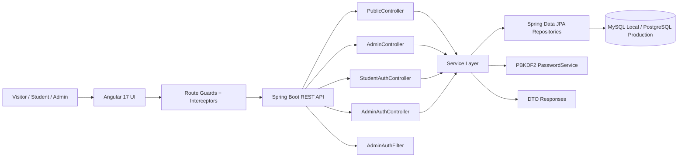
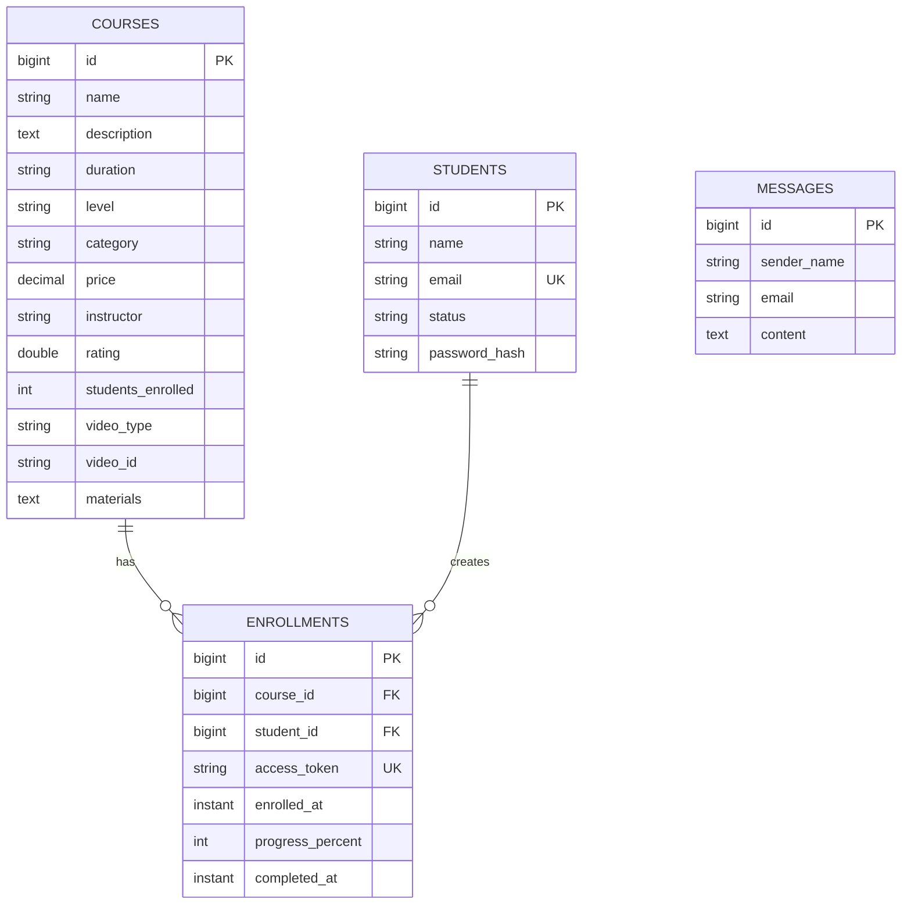

# Institute Management System

<!-- Replace this placeholder with a repository banner or product screenshot. -->


An institute operations platform built with a Spring Boot backend and Angular dashboard. The application handles public course discovery, student enrollment, student learning access, admin course management, student records, contact messages, enrollment tracking, and protected dashboards from a single full-stack codebase.

This repository is designed to show more than CRUD screens. It demonstrates API design, layered backend architecture, JPA data modeling, session-based access control, form validation, Angular route guards, environment-specific configuration, database-backed workflows, deployment configuration, and backend test coverage.

## Live Demo

| Service | URL |
|---|---|
| Frontend | [https://lovely-art-production.up.railway.app](https://lovely-art-production.up.railway.app) |
| Backend API | [https://institute-management-system-production-ef72.up.railway.app](https://institute-management-system-production-ef72.up.railway.app) |
| Health Check | [Backend Health Endpoint](https://institute-management-system-production-ef72.up.railway.app/api/public/health) |

> **Note**
> Demo credentials are intended for local review only. Production admin credentials should always be supplied through environment variables.

## Project Highlights

| Area | What This Project Shows |
|---|---|
| Backend design | Controller, service, repository, DTO, entity, and configuration layers with clear ownership. |
| Frontend design | Angular standalone components, lazy-loaded routes, guards, services, and reactive forms. |
| Authentication | Separate admin and student login flows using expiring bearer tokens. |
| Course workflow | Public catalog, course detail pages, enrollment, learning access, progress updates, and admin course management. |
| Persistence | Spring Data JPA repositories backed by MySQL locally and PostgreSQL in production. |
| Deployment | Railway deployment configuration, production profile, Dockerfile for backend packaging, and compose files for local services. |
| Testing | Backend unit, JPA, service, parser, and controller integration test classes. |

### Recruiter-Friendly Snapshot

| Metric | Current Repository |
|---|---:|
| REST handler methods | 28 |
| Angular component files | 19 |
| Angular service files | 7 |
| Core domain tables | 4 |
| Backend test classes | 10 |
| Business modules | Courses, Students, Enrollments, Messages, Auth, Reports |

## Screenshots

Replace these placeholders with current screenshots from your deployed application.

| Screen | Preview |
|---|---|
| Dashboard | `docs/screenshots/dashboard.png` |
| Admin Login | `docs/screenshots/admin-login.png` |
| Student Dashboard | `docs/screenshots/student-dashboard.png` |
| Course Management | `docs/screenshots/course-management.png` |
| Enrollment | `docs/screenshots/enrollment.png` |
| Reports | `docs/screenshots/reports.png` |

## Architecture Diagram



## Features

### Public Experience

- Course catalog with course details, pricing, level, instructor, thumbnail, materials, and embedded learning media metadata.
- Contact form that stores enquiries for admin review.
- Institute information and health endpoints for public pages and deployment checks.

### Student Experience

- Course enrollment with name, email, and password.
- Student login with expiring access token.
- Student dashboard showing enrolled courses.
- Learning page access through enrollment access tokens.
- Progress tracking from 0 to 100 percent with completion timestamp support.

### Admin Experience

- Admin login and logout.
- Protected admin routes and backend endpoints.
- Course create, read, update, and delete workflows.
- Student list, student detail, create, update, and delete workflows.
- Message list, message detail, create, and delete workflows.
- Enrollment overview ordered by most recent enrollment.
- Dashboard and reports views in the Angular application.

<details>
<summary><strong>Business Modules</strong></summary>

| Module | Responsibility |
|---|---|
| Course Management | Maintains the institute course catalog and learning metadata. |
| Student Management | Stores student profiles, status, and password hash references. |
| Enrollment Management | Links students to courses, creates access tokens, and tracks progress. |
| Message Management | Captures contact form enquiries for admin review. |
| Authentication | Handles admin and student login sessions separately. |
| Reporting UI | Provides admin-facing reporting and dashboard navigation. |

</details>

## Engineering Highlights

| Practice | How It Appears in the Codebase |
|---|---|
| Layered Architecture | REST controllers delegate business rules to services, while repositories own persistence. |
| Separation of Concerns | Angular components handle view behavior; services own HTTP communication; guards protect routes. |
| REST API Design | Resource-oriented routes for courses, students, messages, enrollments, auth, learning access, and health. |
| Spring Boot | Used for dependency injection, embedded server runtime, profile-based configuration, REST controllers, and production packaging. |
| Spring Data JPA | Removes boilerplate persistence code while keeping repository methods expressive and testable. |
| Hibernate | Maps `Course`, `Student`, `Enrollment`, and `Message` objects to relational tables with constraints and relationships. |
| Validation | Backend services validate required fields, email format, password length, media type, and progress range; Angular forms add client-side validation. |
| Error Handling | Controllers return explicit HTTP status codes through `ResponseEntity`; Angular centralizes client error handling in `ErrorHandlerService`. |
| Global Exception Handling | Identified as the next backend hardening step: move repeated controller error branches into a Spring `@ControllerAdvice` response layer. |
| Clean Code | Business behavior is grouped into focused services such as `EnrollmentService`, `PasswordService`, `AdminAuthService`, and `StudentAuthService`. |
| Responsive Angular UI | Angular Material, SCSS, standalone components, and lazy routes support a dashboard-style admin experience. |
| Environment Configuration | Local and production profiles separate database URLs, credentials, ports, admin sessions, and student sessions. |
| Docker | Backend has a multi-stage Dockerfile; compose files define local service wiring and production deployment patterns. |
| Production Deployment | Railway-ready production profile connects to PostgreSQL through environment variables. |

### Software Engineering Principles

- **SOLID:** Services are split by responsibility instead of one all-purpose application class.
- **MVC:** Controllers expose HTTP boundaries, models represent domain data, and Angular components handle views.
- **DTO Pattern:** Public and dashboard responses avoid exposing every persistence field directly.
- **Repository Pattern:** JPA repositories isolate database access from controllers and UI concerns.
- **Dependency Injection:** Spring injects services, repositories, config values, and filters through constructors.

## Technology Stack

| Technology | Why It Was Chosen |
|---|---|
| Java 17 | Stable long-term Java runtime with strong typing, mature tooling, and broad backend hiring relevance. |
| Spring Boot 3.5 | Used for fast backend development, dependency injection, REST APIs, profiles, and deployable application packaging. |
| Spring Data JPA | Keeps data access readable through repository interfaces while still supporting custom finder methods. |
| Hibernate | Handles object-relational mapping, lazy relationships, table constraints, and schema updates during development. |
| Angular 17 | Fits admin dashboards well through structured routing, TypeScript, reactive forms, services, and reusable components. |
| Angular Material | Provides production-style UI controls for forms, navigation, tables, and dashboard screens. |
| MySQL | Local relational database for day-to-day development through the `local` Spring profile. |
| PostgreSQL | Production database target for Railway deployment. |
| Maven | Standard Java build lifecycle for compiling, testing, and packaging the backend. |
| Docker | Packages the backend in a repeatable Java 17 container and supports service orchestration through Compose. |
| Railway | Hosts the deployed backend and frontend URLs referenced above. |

## Project Structure

```text
Institute-Management-System-main/
|-- backend/
|   `-- backend/
|       |-- Dockerfile
|       |-- pom.xml
|       `-- src/
|           |-- main/
|           |   |-- java/com/institute/
|           |   |   |-- InstituteBackendApplication.java
|           |   |   |-- admin/
|           |   |   |   |-- controller/
|           |   |   |   |-- dto/
|           |   |   |   |-- model/
|           |   |   |   |-- repository/
|           |   |   |   `-- services/
|           |   |   `-- config/
|           |   `-- resources/
|           |       |-- application.properties
|           |       |-- application-local.properties
|           |       `-- application-prod.properties
|           `-- test/java/com/institute/
|-- frontend/
|   |-- angular.json
|   |-- package.json
|   `-- src/app/
|       |-- components/
|       |-- guards/
|       |-- models/
|       |-- services/
|       `-- app.routes.ts
|-- public-website/
|   |-- Dockerfile
|   |-- nginx.conf
|   `-- src/
|-- docker-compose.yml
|-- docker-compose.production.yml
`-- README.md
```

## REST API Overview

### Public APIs

| Method | Endpoint | Purpose |
|---|---|---|
| `GET` | `/api/public/courses` | List public course catalog. |
| `GET` | `/api/public/courses/{id}` | Fetch course details. |
| `POST` | `/api/public/courses/{id}/enroll` | Enroll a student in a course. |
| `GET` | `/api/public/learning/{accessToken}` | Open enrolled learning content. |
| `PUT` | `/api/public/learning/{accessToken}/progress` | Update course progress. |
| `POST` | `/api/public/contact` | Submit a public enquiry. |
| `GET` | `/api/public/institute-info` | Return institute profile information. |
| `GET` | `/api/public/health` | Deployment health check. |

### Authentication APIs

| Method | Endpoint | Purpose |
|---|---|---|
| `POST` | `/admin/auth/login` | Admin login. |
| `POST` | `/admin/auth/logout` | Admin logout. |
| `POST` | `/api/student/auth/login` | Student login. |
| `POST` | `/api/student/auth/logout` | Student logout. |
| `GET` | `/api/student/dashboard` | Student dashboard for authenticated students. |

### Admin APIs

| Method | Endpoint | Purpose |
|---|---|---|
| `GET` | `/admin/courses` | List courses. |
| `POST` | `/admin/courses` | Create course. |
| `GET` | `/admin/courses/{id}` | Fetch one course. |
| `PUT` | `/admin/courses/{id}` | Update course. |
| `DELETE` | `/admin/courses/{id}` | Delete course. |
| `GET` | `/admin/students` | List students. |
| `POST` | `/admin/students` | Create student. |
| `GET` | `/admin/students/{id}` | Fetch one student. |
| `PUT` | `/admin/students/{id}` | Update student. |
| `DELETE` | `/admin/students/{id}` | Delete student. |
| `GET` | `/admin/messages` | List messages. |
| `POST` | `/admin/messages` | Create message. |
| `GET` | `/admin/messages/{id}` | Fetch one message. |
| `DELETE` | `/admin/messages/{id}` | Delete message. |
| `GET` | `/admin/enrollments` | List enrollment summaries. |

<details>
<summary><strong>Example Enrollment Request</strong></summary>

```http
POST /api/public/courses/1/enroll
Content-Type: application/json

{
  "name": "Aarav Sharma",
  "email": "aarav@example.com",
  "password": "Student@123"
}
```

</details>

## Database Design



| Table | Design Detail |
|---|---|
| `courses` | Stores catalog content, pricing, instructor data, media metadata, and learning materials. |
| `students` | Enforces unique student emails and hides password hashes from JSON responses. |
| `enrollments` | Uses a unique `(course_id, student_id)` constraint to prevent duplicate enrollments. |
| `messages` | Stores public contact submissions for admin follow-up. |

## Security Features

- Admin endpoints under `/admin/**` are protected by `AdminAuthFilter` when `app.admin.auth.enabled=true`.
- Admin login uses environment-configured credentials and expiring bearer tokens.
- Student login uses email/password validation and expiring bearer tokens.
- Student passwords are hashed with PBKDF2 using salt and 120,000 iterations.
- Password hashes are excluded from API serialization with `@JsonIgnore`.
- Learning pages use unique enrollment access tokens.
- CORS is restricted to local development origins and deployed frontend URLs.
- Production credentials are read from environment variables, not hardcoded into the production profile.

## Deployment Details

| Concern | Configuration |
|---|---|
| Backend host | Railway |
| Frontend host | Railway |
| Production database | PostgreSQL |
| Local database | MySQL |
| Backend profile | `prod` for production, `local` by default |
| API base URL | Configured in Angular environment files |

### Production Environment Variables

```env
SPRING_PROFILES_ACTIVE=prod
SPRING_DATASOURCE_URL=jdbc:postgresql://<host>:<port>/<database>
SPRING_DATASOURCE_USERNAME=<username>
SPRING_DATASOURCE_PASSWORD=<password>
ADMIN_EMAIL=<admin-email>
ADMIN_PASSWORD=<admin-password>
ADMIN_NAME=Administrator
ADMIN_SESSION_HOURS=8
STUDENT_SESSION_HOURS=24
```

> **Tip**
> Keep production credentials in Railway variables or your hosting provider's secret manager. Do not commit real credentials.

## Docker Support

The backend includes a multi-stage Dockerfile:

```dockerfile
FROM maven:3.9.6-eclipse-temurin-17 AS build
FROM eclipse-temurin:17-jdk-alpine
```

Local Compose file:

```bash
docker compose up --build
```

What is currently included:

| File | Purpose |
|---|---|
| `backend/backend/Dockerfile` | Builds and runs the Spring Boot API as a Java 17 container. |
| `docker-compose.yml` | Defines backend, frontend, and MySQL service wiring for local orchestration. |
| `docker-compose.production.yml` | Provides a production-oriented service blueprint with backend, website, database, and Nginx sections. |
| `public-website/Dockerfile` | Builds the public website container. |

> **Note**
> The admin `frontend/` directory currently does not include its own Dockerfile. Add one before relying on the frontend service in `docker-compose.yml`.

## Installation

### Prerequisites

| Tool | Version |
|---|---|
| Java | 17+ |
| Node.js | 18 recommended |
| npm | 9+ |
| MySQL | 8+ |
| Maven | Wrapper included for backend |

## Running Locally

### 1. Start MySQL

Create a database named `ims`, or let the configured JDBC URL create it automatically.

```env
MYSQL_URL=jdbc:mysql://localhost:3306/ims?createDatabaseIfNotExist=true&useSSL=false&allowPublicKeyRetrieval=true&serverTimezone=Asia/Kolkata
MYSQL_USERNAME=root
MYSQL_PASSWORD=<your-password>
```

### 2. Start Backend

```bash
cd backend/backend
./mvnw spring-boot:run
```

On Windows:

```powershell
cd backend/backend
.\mvnw.cmd spring-boot:run
```

Backend runs at:

```text
http://localhost:8080
```

### 3. Start Frontend

```bash
cd frontend
npm install
npm run build
npx ng serve
```

Frontend runs at:

```text
http://localhost:4200
```

### Local Admin Login

```text
Email: admin@example.com
Password: Admin@123
```

> **Note**
> Change `ADMIN_EMAIL` and `ADMIN_PASSWORD` before any shared or hosted deployment.

## Future Enhancements

- Add a centralized Spring `@ControllerAdvice` for consistent error response bodies.
- Add Bean Validation annotations and request DTOs for all create/update endpoints.
- Add a Dockerfile for the admin Angular frontend.
- Replace in-memory session storage with persistent/session-store backed tokens for multi-instance deployments.
- Add CI checks for backend tests and Angular builds.
- Add API documentation through OpenAPI/Swagger.
- Add role and permission modeling if more admin user types are introduced.

## Contributing

Contributions are welcome through issues and pull requests.

1. Fork the repository.
2. Create a feature branch.
3. Keep changes focused and tested.
4. Run backend tests before opening a pull request.
5. Describe the behavior change and screenshots when UI is affected.

```bash
cd backend/backend
./mvnw test
```

## License

No license file is currently included in this repository. Add a license before accepting external contributions or reusing the project in another product.

## Author

**Virendra Sonar**<br>
Full-Stack Java Developer

Built to demonstrate Java, Spring Boot, REST API design, relational persistence, Angular dashboards, authentication flows, deployment configuration, and clean full-stack engineering practices.
